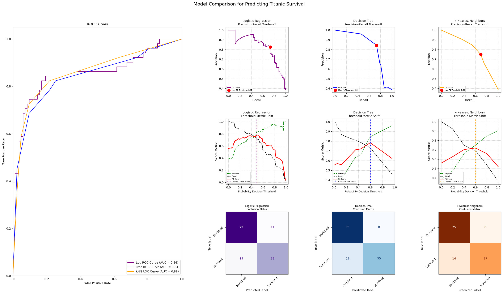

# Titanic Survival Classifier

A comparison of three classification models — Logistic Regression, Decision Tree, 
and k-Nearest Neighbors — predicting passenger survival on the Titanic.

## Dataset

[Kaggle Titanic dataset](https://www.kaggle.com/competitions/titanic/data) (891 passengers).

**Features used:** Pclass, Sex, Age, SibSp, Parch, Fare, Embarked
**Dropped:** Name, Ticket, Cabin (unique/mostly-missing identifiers, not predictive as-is)
**Target:** Survived (0 = perished, 1 = survived)

**Preprocessing:**
- Missing Age filled with median, missing Embarked filled with mode
- Sex and Embarked encoded to numeric
- Features scaled with `StandardScaler` (fit on training data only)
- Split 70/15/15 into train / validation / test, stratified by survival

## Approach

1. Train all three models on the training set
2. Tune `max_depth` (tree) and `n_neighbors` (kNN) with `GridSearchCV`
3. Pick each model's decision threshold by maximizing F1 on the **validation** set
4. Evaluate final performance on the **held-out test set**, which none of the three 
   models or thresholds were tuned on

## Results



| Model | AUC | Accuracy | Precision (Survived) | Recall (Survived) |
|---|---|---|---|---|
| Logistic Regression | 0.86 | 82% | 78% | 75% |
| Decision Tree | 0.84 | 82% | 81% | 69% |
| k-Nearest Neighbors | 0.86 | 84% | 82% | 73% |

## Takeaway

Adding a Title feature (extracted from passenger names — Mr/Mrs/Miss/Master/Rare)
improved all three models, most notably Logistic Regression (AUC 0.83 → 0.86).
kNN now has the best accuracy (84%), while Logistic Regression and kNN are tied
for the best AUC (0.86). The Decision Tree has the best precision (81%, fewest
false positives at 8). Which model "wins" still depends on what's being
optimized for — overall ranking quality (AUC) vs. minimizing false alarms
(precision) vs. raw accuracy.

## Usage

```bash
pip install -r requirements.txt
python titanic_classifier.py
```

## What I'd improve next

- Try cross-validation instead of a single validation split for threshold selection
- Test an ensemble of the three models